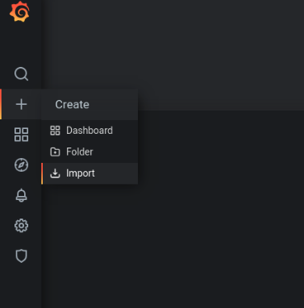
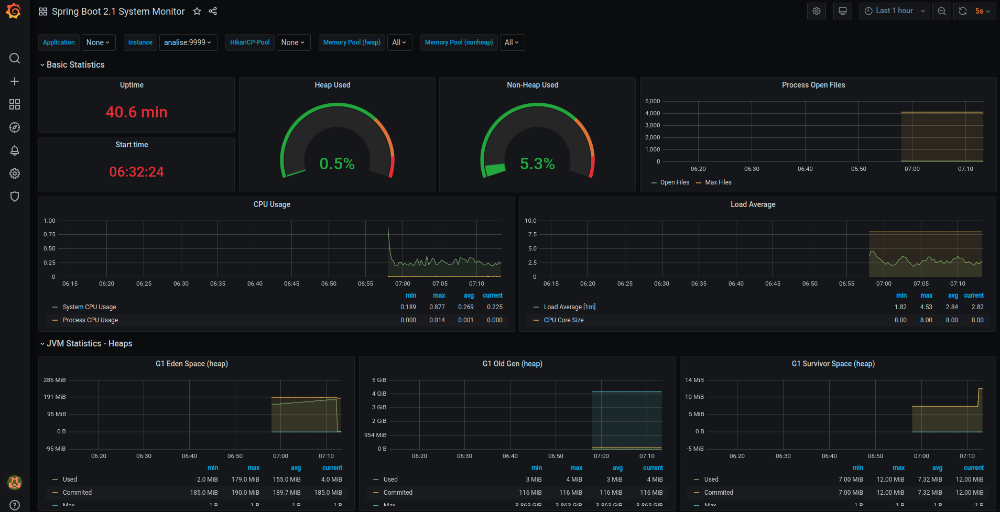

# Importando gráficos Grafana

Já sabemos como realizar login e configurar um datastore no grafana, então agora
podemos ir para parte mais legal, que é ver os gráficos funcionando.

Então vamos lá!!!

Primeiro vamos localizar o menu do nosso canto superior direito, esse é o modelo
que o grafana está usando nas versões atuais.

Localize o menu import abaixo, como na figura abaixo

Temos um dashboard pré-configurado com configurações de métricas padrão reportadas
pelo Spring Boot, você pode encontrar ele [aqui](../ops/grafana/spring-boot.json)

Copie o conteúdo do arquivo e cole no campo *Import via panel json*, como mostrado
na figura abaixo

Então pressione o botão **Load**

No próximo passo você será redirecionado para configurar as opções do **Dashboard**, neste tela você pode
escolher um nome para seu Dashboard, folder que é uma estrutura de diretórios de gráficos
e o mais importante que é a fonte de seus dados.

Fizemos previamente a configuração de fonte de dados, mas se você não chegou nesse passo recomendamos
realizá-lo, [você pode aprender como fazer clicando aqui](configurando_datastore_grafana.md)

Escolha a fonte de dados e clique em **Import**

Depois de clicar em **Import** você será redirecionado para seu dashboard como na figura abaixo!!!

Massa!!! Perceba que muitas métricas já estão sendo usadas no gráfico. No Canto superior direito
já temos a métrica **Uptime** do nosso serviço de _Análise Financeira_. Perceba como
a utilização de uma ferramenta de gráficos nos ajudar de maneira bem rápida entender alguns
comportamentos do nosso sistema.

Logo abaixo da métrica de **Uptime** temos a utilização de **CPU** pelo nosso serviço de Análise. Note
que rapidamente conseguimos perceber que ele está operando sem nenhuma pressão, devido ao baixo consumo de 
CPU.

## Informações de suporte

* Se você não tem idéia do que é o Grafana, [aqui você pode encontrar uma boa definição](https://grafana.com/) 

* Se você tem alguma dúvida do que é o Grafana, [aqui você pode encontrar a documentação oficial](https://grafana.com/docs/grafana/latest/)

* Ou ainda você pode estar se perguntando, tem alguma fonte que explica os itens básicos do **Grafana**, [esse link explora algumas das principais funcionalidades e como configurá-las](https://grafana.com/docs/grafana/latest/getting-started/getting-started/)

* Você pode ter gostado de importar seu dashboard e pode estar se perguntando "Existe mais opções de dashboards pré construídos???". [Este link conta com uma coleção
de dashboards que podem ser usados](https://grafana.com/grafana/dashboards)
