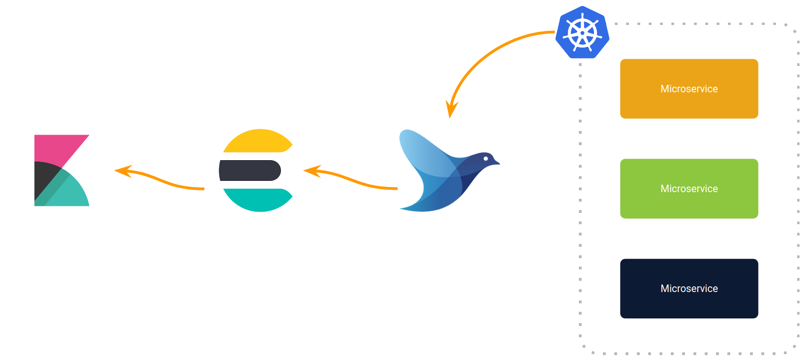

# Logs. XI do 12 Factor Apps

Talvez seu código não está funcionando e está com dificuldade de encontrar o problema, não se preocupe!

Uma das maneiras de se encontrar um erro é por meio de Logs!

Log de dados é um arquivo de texto gerado por um software para descrever eventos sobre o seu funcionamento, 
utilização por usuários ou interação com outros sistemas. Um log, após ser gerado, passa a ser incrementado ao 
longo do tempo com informações que permitem diagnosticar possíveis bugs!

O grande problema é que geralmente os logs são gerados em arquivos e há a necessidade de roteamento dos mesmos!

No 12 Factor Apps nunca devemos nos preocupar com o roteamento ou armazenagem do seu fluxo de saída. Nossa aplicação não 
deve tentar escrever ou gerir arquivos de logs. No lugar, cada aplicação em execução escreve seu próprio fluxo de evento, 
sem buffer, para o **stdout**.

Logando no **stdout**, cada fluxo de logs de cada aplicação serão capturados pelo ambiente de execução e direcionados 
para um ou mais destinos finais para visualização e arquivamento de longo prazo. Estes destinos de arquivamento não são 
visíveis ou configuráveis pelo aplicação, e ao invés disso, são completamente geridos pelo ambiente de execução. Agregadores 
de logs open source (Logstash, Fluentd, Fluent bit) estão disponíveis para este propósito.

Ficou confuso, não se preocupe! Essa imagem pode te ajudar a visualizar melhor!

Demais né! Como o fato de logar no **stdout** e utilizar um agregador de log pode ajudar muito em troubleshooting!

## Informações de suporte

* Talvez você queira o link da documentação oficial!? [Aqui você pode encontrá-lo!](https://12factor.net/pt_br/logs)

Quer saber mais sobre logs? Acesse o [link!](https://docs.spring.io/spring-boot/docs/current/reference/html/spring-boot-features.html#boot-features-logging)

Quer saber mais sobre coletores\agregador de logs? Acesse o [link!](https://opensource.com/article/18/9/open-source-log-aggregation-tools)